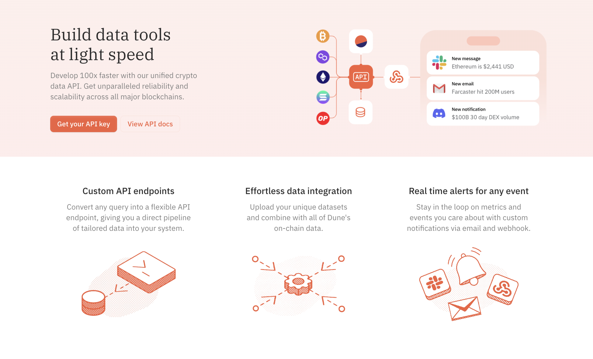
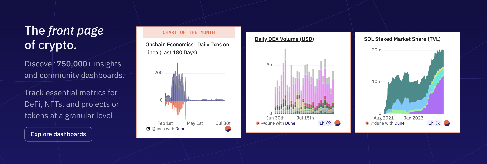
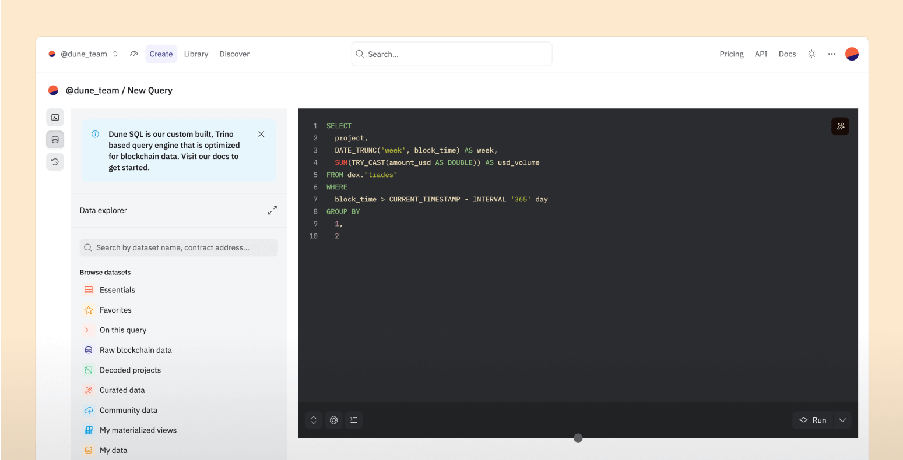
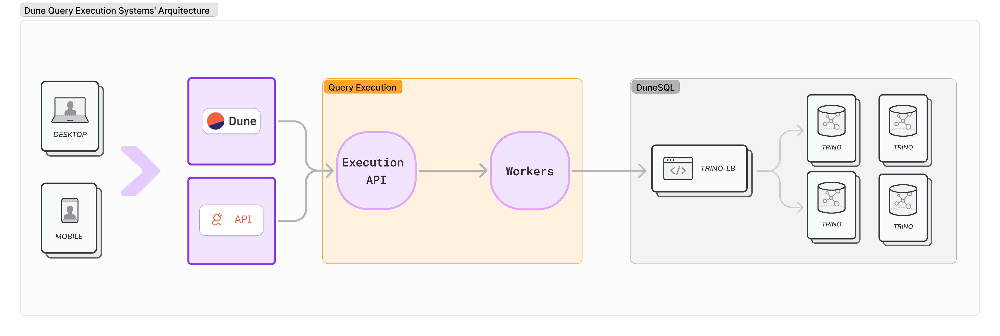
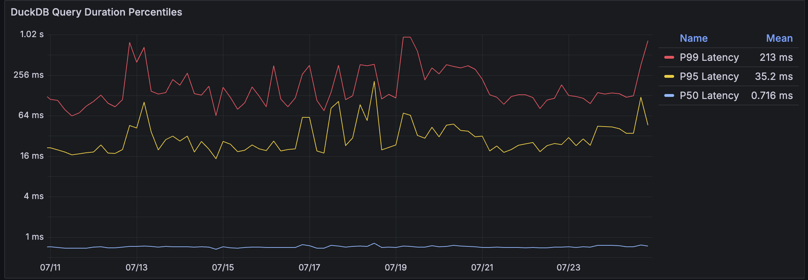
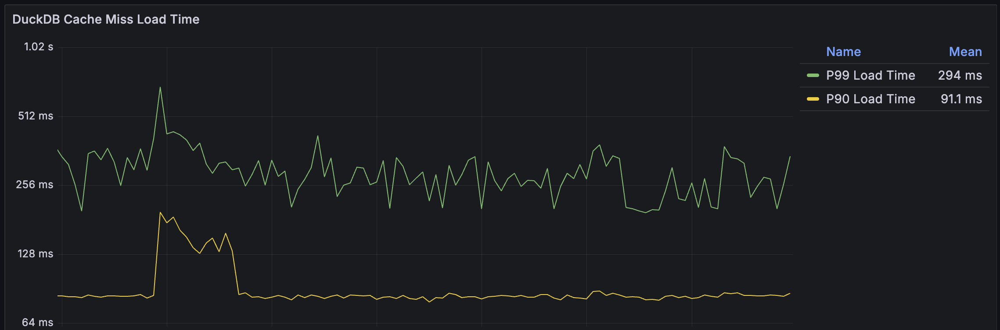
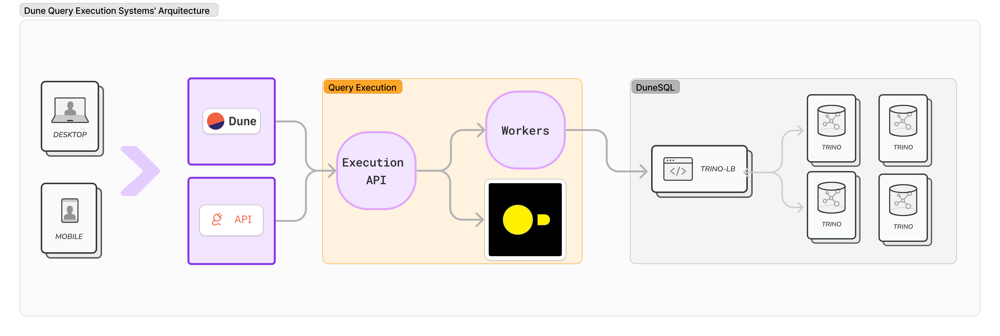

# How we've improved Dune API using DuckDB

At [Dune](https://dune.com), we value our customers’ feedback and are committed to continuously improving our services. This is the story of how a simple, prioritized feature request for [DuneAPI](https://dune.com/product/api) —supporting query result pagination for larger results—evolved into a comprehensive improvement involving the adoption of [DuckDB](https://duckdb.org) at Dune.

We’ve learned a lot during this journey and are excited to share our experiences and the new functionalities we’ve been building.

## Motivation & Context

The journey began with user feedback and a repeated feature request: “Dune API doesn’t support pagination, and the maximum size of query results is limited (~1GB).” Users needed to read larger results, which required supporting pagination. At the end of 2023, we finally prioritized resolving this issue.

### Why no pagination and 1GB limit?

To address this question, let’s start with understanding our initial architecture and its limitations.

Our original capabilities were designed to serve the needs of [Dune Analytics](https://DUNE.COM), a platform focused on visualizing crypto data through dashboards and graphs. 

 This use case leveraged the following architectural decisions:

  1. Query-Driven Visualizations: Each visualization on a dashboard was tied to a specific SQL query. This setup allowed for consistent and static data views, which were suitable for our initial visualization-centric use cases.
  1. Powerful Query Execution: SQL Queries offer the expressiveness and capability for rich and complex data manipulations required to query and aggregate large datasets

  1. Small, Reusable Query Results: Visualizations typically require manageable data sizes, optimized for quick rendering on dashboards. Large datasets were unnecessary, as visual elements have limited pixel space and do not need millions of data points.
  1. Caching: To improve performance, we cached query results. This approach was suitable for dashboards that repeatedly accessed the same query results, reducing the need for re-execution.

However, these design choices led to significant limitations:

- 1GB Result Cap: The API was capped at 1GB per query result because larger results were unnecessary for visualization purposes and could overwhelm the system’s memory.
- No Pagination: Since visualizations generally required the entire dataset at once, there was no need for pagination.
- Expensive Query Execution: our query execution is powerful but can be too slow or computationally expensive

## Expanding the Use Cases Served by Dune API

To truly serve our developer community, we needed to look holistically at their needs, beyond just supporting pagination. Our goal was to create features that seamlessly integrate with each other and existing Dune functionalities.

### Understanding Developer Needs Through User Stories

Instead of focusing narrowly on specific feature requests, we explored real-world use cases and “jobs to be done.” This approach helped us understand the broader context of developer needs. We crafted concrete user stories to guide our feature development:

  1. Search and Filter: Jesse needs an app to search and filter large query results by wallet address or time window, requiring advanced filtering and efficient handling of large datasets.
  2. Data for Charts: Logan needs to feed specific data into charts for mobile, requiring low network data usage and dynamic sorting and filtering.
  3. Data Science: Another use case involves performing data science on large sets of crypto transactions, emphasizing the need for pagination and efficient data handling.

**Example: Joan’s Mobile App**

Consider Joan, a developer who wants to create a mobile app that visualizes Wallet Balances. Her app allows users to follow their wallet activities over time through infographics. For Joan’s app to be viable, it must be inexpensive to make multiple requests to DuneAPI for each user.

This example underscores the importance of thinking from the users’ perspective and visualizing the functionalities they need. It’s not just about a single feature but how different features can work together.

**Holistic Approach to API Development**

By stepping back and considering these diverse use cases, we aimed to build a more flexible API focused on application needs rather than strictly on SQL query execution. Our approach involved:

- Flexibility and Integration: Developing an API that easily integrates with existing Dune functionalities.
- Real-Life Applications: Using real-life applications, like Dune dashboarding, to guide feature development.
- Leveraging Technology: Using new technologies to bridge user needs and our engineering capabilities.
- Maximizing Value: Extending the use cases we cover with existing DUNE queries and query results, maximizing the value provided to our users.

This holistic approach not only addressed immediate feature requests but also paved the way for a more robust and versatile DuneAPI, empowering developers to build innovative applications.

## DuneSQL & Query Results

All our data at Dune is queriable with [DuneSQL](https://dune.com/blog/introducing-dune-sql). Users utilize it to query our 1.8 million tables, producing the insightful public dashboards on dune.com. Given the vast amount of tables and their sizes, DuneSQL employs [Trino](https://trino.io), a distributed query engine that uses extensive parallel compute to query our data lake. DuneSQL queries are extremely powerful but heavyweight, with response times often around a dozen seconds or more.

We've improved Trino to better meet our needs before ([#18719](https://github.com/trinodb/trino/pull/18719), [#21609](https://github.com/trinodb/trino/pull/21609), [#21602](https://github.com/trinodb/trino/pull/21602), [#20851](https://github.com/trinodb/trino/pull/20851), [#20662](https://github.com/trinodb/trino/pull/20662), [more](https://github.com/trinodb/trino/pulls?q=is%3Apr+author%3Ajkylling)). Lets look at what we need to meet our new needs.

Running a filter or query on an existing result requires:

- **Reading/Querying Cached Results**: Support our cached Results format.
- **Low-Latency Response**: Queries must return within 100-200 milliseconds for interactive use.
- **Cost-Effective Execution**: Ensuring execution is inexpensive enough to allow multiple requests per user interaction.

This diagram illustrates the architecture of a typical DuneSQL deployment, including the Dune Website, Dune API, Query Execution layer, and the DuneSQL clusters.

In short, while DuneSQL is incredibly powerful, adapting it to meet these new requirements was challenging. It required significant engineering effort to modify Trino to handle cached query results efficiently while maintaining low latency and cost-effective execution, demonstrating that DuneSQL was not the ideal solution for these specific needs.

## Using DuckDB as a Stepping Stone

We switched to search for new technologies that better meet our needs. Here’s a breakdown of our thought process and why we ultimately chose [DuckDB](https://duckdb.org).

### Evaluating Options

We had two primary options:

1. **Load Query Results into Another Database**: This approach would involve selecting a database with better cost-effective performance suited to our use case than Trino.
2. **Implement Features Directly**: Building our functionalities on top of our existing query-result format (which was compressed JSON).

### Considering Future Growth

Beyond our immediate needs, we also had to plan for future functionalities:

- **Aggregation Functions**: Allowing for aggregation operations on specific columns.
- **Re-ordering Results**: Enabling re-ordering by any column.
- **Handling Larger Results**: Increasing the query result limit from 1GB to potentially 20GB or more.
- **Parquet Query Result Format**: Improving our query results format, moving from compressed JSON to [Parquet](https://parquet.apache.org/docs/overview/).

### Technical Challenges

While some functionalities, like pagination, were straightforward, supporting larger results, fast search/filtering on rows or columns, and sampling required more sophisticated solutions. Re-implementing these from scratch would be akin to developing a new query execution engine.

### Criteria for a New Query Engine

We needed a query engine that could:

- **Support Our Query Result Format**: Compatible with compressed JSON and Parquet.
- **Fast Query Execution**: Return results in less than 100 milliseconds.
- **Cost-Effective**: Lightweight and inexpensive, allowing multiple queries per minute without significant costs.

[NOTE: For the sake of brevity, I'm not including many design considerations and non-functional requirements such as high availability, fault tolerance, scalability, security (auth, confidentiality, and integrity).]

### Advantages of DuckDB

We experimented using DuckDB as an embedded, fast query engine on our API server side. The idea was to load (and cache) our query results into DuckDB quickly, enabling us to serve API requests with sub 100 millisecond response times. This approach would allow us to meet user demands efficiently and cost-effectively.

DuckDB stood out due to its features and benefits:

- **Data Format Support**: It supports querying and loading data directly from JSON and Parquet.
- **High-Performance SQL Engine**: Its robust and modern SQL engine supported our required usecases within our latency and cost requirements.
- **Flexibility**: The ability to handle advanced query functionalitities and larger datasets without significant changes.
- **Easy to use**: We had a working prototype of loading and querying our query results in an single day.

Our query results, stored in compressed JSON, were compatible with DuckDB. Migrating to Parquet brought benefits like smaller file sizes, and faster load/query times. Parquet's compatibility with DuneSQL opened new possibilities for integrating query results with our vast data lake.

Here are the performance metrics from production, demonstrating DuckDB's efficiency. We observed that 95% of queries were completed with response times under 100 milliseconds. In the majority of cases, response times were impressively fast, typically between 1 to 2 milliseconds.

DuckDB Query Response Time: 

DuckDB Query Result Load Time:

In summary, DuckDB provided the performance, flexibility, and future-proofing we needed to enhance our API and serve our users better. This strategic choice enabled us to extend our functionalities and offer a more robust and versatile platform for developers.

## Final Architecture

So now at Dune we run & operate two database technologies that are directly used by our users: [DuneSQL](https://dune.com/blog/introducing-dune-sql) & [DuckDB](https://duckdb.org), for both of them we have deeply integrated them and have specific APIs and features to better serve our users. We have also fully migrated all user queriable data: both the Tables and the Query Results to Parquet.

Our final architecture diagram now resembles this:

## New Features and APIs powered by DuckDB

So, with this effort we have accomplished the basic goal of addressing important limitations on our [SQL Endpoints API](https://docs.dune.com/api-reference/executions/execution-object) by providing these functionalities:

- [Pagination](https://docs.dune.com/api-reference/executions/pagination): Retrieve data in manageable chunks to handle large datasets.
- [Filtering](https://docs.dune.com/api-reference/executions/filtering): Apply filters to query results based on specific columns and criteria.
relevance.
- [Sorting](https://docs.dune.com/api-reference/executions/sorting):  Organize query results in a specified order.
- [Sampling](https://docs.dune.com/api-reference/executions/sampling): Retrieve an uniform sample of the dataset for efficient data analysis and visualization.

But by integrating well with other functionalities of Dune (such as [Query Scheduler](https://docs.dune.com/web-app/query-editor/query-scheduler) and [Materialized views](https://docs.dune.com/query-engine/materialized-views) for example) it powers also:

- [Custom Endpoints](https://docs.dune.com/api-reference/custom/overview), which allow users to create and manage API endpoints from Dune queries.

- *Preset Endpoints*, which provide quick access to standardized and essential data, eliminating the need for custom queries for frequently needed information.

  - [Contracts](https://docs.dune.com/api-reference/evm/endpoint/contracts): Data on blockchain contracts.
  - [DEX Metrics](https://docs.dune.com/api-reference/dex/endpoint/dex_pair): Information on decentralized exchanges.
  - [EigenLayer](https://docs.dune.com/api-reference/eigenlayer/introduction) and [Farcaster](https://docs.dune.com/api-reference/farcaster/introduction): Metrics and data related to specific projects and technologies.
  - [Marketplace Marketshare](https://docs.dune.com/api-reference/markets/endpoint/marketplace_marketshare): Key market indicators and trends.
  - [Linea](https://docs.dune.com/api-reference/projects/endpoint/linea_lxp): Insights and data on specific blockchain project

## Conclusion

As we navigated the journey of enhancing DuneAPI, we experienced firsthand “feature creep”— that moment when you start with a simple request and end up redesigning half the system. But feature creep doesn’t have to be scary. By stepping back and looking at the bigger picture of our customers’ needs, we found opportunities to innovate and build a better service.

Incorporating [DuckDB](https://duckdb.org) was not just about addressing a single feature request; it was about rethinking how we can serve our users more effectively. By being open to evolving our approach and investing in scalable, efficient technologies, we’ve expanded the capabilities of DuneAPI, making it a powerful tool for developers.

We hope you find these new features and improvements valuable. As always, we’re excited to see how you’ll leverage them to create even more amazing applications and insights. Stay tuned for more updates, and keep those feedback and feature requests coming—they’re the real MVPs!

For more details, visit our [API documentation](https://docs.dune.com/api-reference/overview/introduction).
